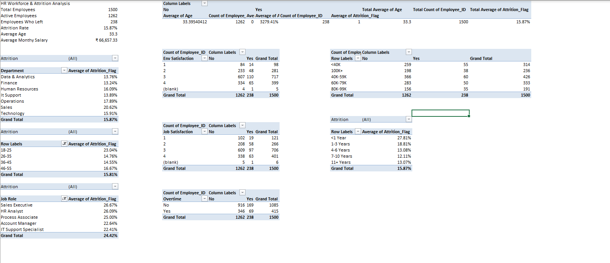
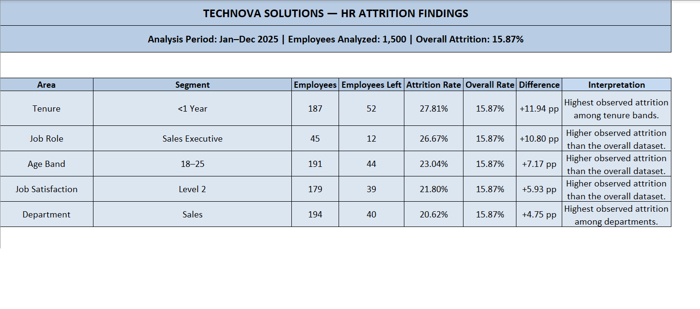

# 📊 TechNova HR Employee Attrition & Workforce Analysis

> A data analytics project focused on understanding employee attrition patterns and identifying workforce segments that require further investigation.

---

## 📌 Project Overview

TechNova Solutions HR Attrition & Workforce Analysis is an Excel-based data analytics project designed to analyze employee turnover patterns across different workforce segments.

The analysis focuses on:

- Department
- Age band
- Job role
- Job satisfaction
- Salary band
- Employee tenure
- Overtime

The project follows a complete data analytics workflow from raw data preparation and validation to analysis, visualization, and business insights.

---

## 🎯 Business Problem

Employee attrition can affect workforce stability, productivity, and recruitment costs.

The objective of this analysis is to understand:

- What is the overall employee attrition rate?
- Which departments have higher observed attrition?
- Which age groups show higher attrition?
- Which job roles have higher observed attrition?
- Does employee tenure show different attrition patterns?
- How do salary bands, job satisfaction, and overtime relate to observed attrition?

> **Note:** The dataset is synthetic and the findings represent observed patterns in the dataset. They should not be interpreted as causal conclusions.

---

## 📂 Dataset

**Dataset:** TechNova Solutions HR Workforce Dataset  
**Analysis Period:** Jan–Dec 2025  
**Employees Analyzed:** 1,500

### Key Data Fields

- Employee ID
- Age
- Department
- Job Role
- Job Satisfaction
- Salary
- Tenure
- Overtime
- Attrition
- Exit Date

---

## 🔄 Project Workflow

```text
Raw Data
   ↓
Data Quality Assessment
   ↓
Data Cleaning & Transformation
   ↓
Data Validation
   ↓
KPI Calculation
   ↓
Segmentation Analysis
   ↓
PivotTables & PivotCharts
   ↓
Interactive Dashboard
   ↓
Key Findings
   ↓
Business Recommendations
```

---

## 🧹 Data Cleaning & Preparation

The dataset was prepared and validated before analysis.

Key activities included:

- Checking duplicate records
- Standardizing categorical values
- Cleaning salary values
- Handling missing values
- Correcting date formats
- Validating calculated fields
- Checking data consistency
- Preparing analysis-ready data using Power Query

---

## 📊 Key KPIs

| KPI | Value |
|---|---:|
| Total Employees | 1,500 |
| Active Employees | 1,262 |
| Employees Who Left | 238 |
| Overall Attrition Rate | 15.87% |
| Average Age | 33.3 |
| Average Monthly Salary | ₹66,657.33 |

---

## 📈 Dashboard

The interactive Excel dashboard provides an overview of workforce attrition patterns.


### Dashboard Includes

- Attrition rate by department
- Attrition rate by age band
- Top job roles by attrition rate
- Attrition rate by tenure
- KPI cards
- Department slicer
- Job level slicer
- Overtime slicer
- Key findings section

---

## 🔍 Key Findings

### 1. Overall Attrition

The overall observed attrition rate is **15.87%** across 1,500 employees.

### 2. Department

The Sales department has the highest observed department-level attrition at **20.62%**.

### 3. Tenure

Employees with less than one year of tenure show the highest observed attrition at **27.81%**.

### 4. Job Role

Sales Executive has the highest observed attrition among the analyzed top job roles at **26.67%**.

### 5. Age Band

Employees aged 18–25 show an observed attrition rate of **23.04%**.

### 6. Job Satisfaction

Employees with Job Satisfaction Level 2 show an observed attrition rate of **21.80%**.

### 7. Salary Band

The 80K–99K salary band shows an observed attrition rate of **18.32%**.

### 8. Overtime

Employees with overtime show an observed attrition rate of **16.63%**, compared with **15.58%** for employees without overtime.

---

## 📊 Analysis



---

## 💡 Business Implications

The findings suggest several areas that could be investigated further:

- Review the onboarding and early-tenure employee experience.
- Investigate retention challenges within the Sales department.
- Examine role-specific workforce and career progression patterns.
- Explore retention strategies for younger employees.
- Investigate employee satisfaction patterns across departments and tenure groups.
- Further examine compensation and overtime patterns.

> These are areas for further investigation rather than confirmed causes of attrition.

---

## 💡 Key Findings Summary



---

## ⚠️ Analysis Limitations

- The dataset is synthetic and created for analytical/portfolio purposes.
- The analysis identifies observed relationships and patterns but does not establish causation.
- Some categories contain relatively small employee populations and should therefore be interpreted carefully.
- Missing values were retained where appropriate or represented as unknown during analysis.

---

## 🛠️ Tools & Technologies

- Microsoft Excel
- Power Query
- PivotTables
- PivotCharts
- Slicers
- Excel formulas
- Data Cleaning
- Data Analysis
- Data Visualization

---

## 📁 Repository Contents

```text
TechNova-HR-Attrition-Analysis/
│
├── README.md
├── TechNova_HR_Attrition_Analysis.xlsx
│
└── Screenshots/
    ├── dashboard.png
    ├── analysis.png
    └── findings.png
```

---

## 📥 Project Files

**Excel Analysis Workbook:**  
`TechNova_HR_Attrition_Analysis.xlsx`

---

## 👤 About the Project

This project was developed as part of my Data Analytics portfolio to demonstrate practical skills in data cleaning, analysis, visualization, dashboard development, and communicating business insights using Microsoft Excel.

**Project:** TechNova HR Employee Attrition & Workforce Analysis  
**Analysis Period:** Jan–Dec 2025  
**Tool:** Microsoft Excel
